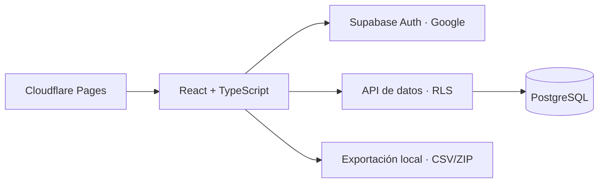

# Nutrición en Familia

Aplicación web para organizar menús y entrenamientos familiares con raciones individuales, seguimiento personal y publicación de planes por semanas.

**[Abrir la aplicación](https://nutricion-family.pages.dev/)** · Pulsa **Explorar una demostración** para recorrer el proyecto sin crear una cuenta. Sus datos son ficticios y los cambios se descartan al recargar. No consulta ni modifica los datos familiares.

## El problema

Una familia puede cocinar un mismo plato y necesitar cantidades distintas. Mantener documentos separados dificulta coordinar las comidas, consultar qué toca hoy y revisar cómo ha ido la semana.

Este proyecto reúne esos flujos en una interfaz en español pensada para móvil: un plato base compartido, raciones por persona y registros que distinguen entre «no realizado» y «sin información».

## Funcionalidades

- **Hoy:** comidas, entrenamiento, alimentación, actividad y descanso diario opcional (horas y calidad).
- **Mi semana:** navegación por días y consulta de semanas anteriores.
- **Mi evolución:** peso, medidas, medias semanales con número de observaciones, historial de descanso y revisión semanal.
- **Administración:** borradores, platos compartidos, raciones personales y publicación con historial.
- **Exportación:** ZIP de CSV por persona y periodo, o respaldo JSON de los datos de la aplicación.
- **Composición corporal:** grasa medida con procedencia y estimación RFM opcional; parámetros guardados por fecha.
- **Revisión asistida:** ChatGPT Work guarda cada semana las instantáneas de Apple Health vía Freddy y una revisión en una bandeja privada, incluso con el PC apagado. Codex recoge las revisiones pendientes cuando está activo y prepara propuestas editables antes de publicar. Sin API de IA de pago; requiere conexiones autorizadas y disponibilidad en la cuenta. [Funcionamiento y límites](docs/HEALTH_AUTOMATION.md).

Consulta la [guía de salud y revisión semanal](docs/HEALTH_AUTOMATION.md) para usar estas funciones y conocer los requisitos de la tarea programada.

La barra móvil es flotante y translúcida. Se oculta al bajar, vuelve al subir y permanece accesible mediante teclado. Se respeta la preferencia de movimiento reducido.

## Arquitectura



**React, TypeScript y Vite** generan el frontend estático. **Supabase** gestiona Google OAuth y PostgreSQL; **Cloudflare Pages** aloja la web. **Recharts** muestra la evolución y **fflate** genera exportaciones en el navegador. Las pruebas usan **Node Test y PGlite**, una instancia local de PostgreSQL.

### Decisiones técnicas

Los planes separan cabeceras versionadas, platos comunes y una instantánea JSON de siete días por persona. Los registros diarios y medidas son relacionales. Esta combinación conserva cada menú publicado y permite consultar el seguimiento de forma independiente.

Una función transaccional valida la publicación, bloquea operaciones concurrentes de una misma semana y comprueba la revisión del borrador. Los planes publicados son inmutables; los cambios crean otra versión. Se muestra la última versión publicada de cada semana que incluya a la persona.

Las fechas usan Europe/Madrid, las unidades son métricas y los formularios aceptan coma decimal. Los campos vacíos no equivalen a cero ni a incumplimiento.

## Probar en local

Requisitos: Node.js 24 y npm.

```bash
npm ci
npm run dev
```

Abre `http://localhost:3000` y pulsa **Explorar una demostración**. Sin variables de Supabase el proyecto funciona solo con datos ficticios en memoria.

Para usar una base de datos propia, copia `.env.example` a `.env.local` y consulta [Instalación](docs/SETUP.md). Las variables `VITE_` son públicas: nunca deben contener una clave administrativa ni el secreto OAuth.

## Calidad

```bash
npm run lint
npm test
npm run build
node scripts/check-build.mjs
```

GitHub Actions ejecuta estas comprobaciones en cada push y pull request sin credenciales externas. Las pruebas cubren aislamiento entre perfiles, acceso anónimo, publicación atómica, historial, conflictos de edición, límites de descanso y medidas, fechas futuras, medias y exportación CSV con protección frente a fórmulas.

Las pruebas locales de RLS simulan las identidades de Supabase. Cada instalación necesita además comprobar su configuración OAuth con usuarios reales.

## Estructura

```text
app/                    Entrada y estilos
components/nutrition/   Pantallas, formularios y administración
hooks/                  Navegación al desplazarse
lib/nutrition/          Modelo, datos, demostración y exportaciones
database/               Esquema y actualizaciones
tests/                  Pruebas funcionales y de PostgreSQL
docs/                   Instalación y guía de uso
scripts/                Importación local y validación del despliegue
```

## Privacidad y alcance

El repositorio no contiene dietas originales, registros de salud, correos autorizados, exportaciones ni credenciales. La lista de cuentas permitidas vive en un esquema privado. Los permisos se aplican en PostgreSQL mediante RLS y no dependen de ocultar elementos de la interfaz.

Está diseñado para tres perfiles fijos y un administrador. Requiere internet; no incluye fotos, notificaciones, restauración automática de respaldos ni ajustes automáticos de dieta. Es una herramienta de organización y seguimiento, no un motor de prescripción nutricional.

Utiliza planes gratuitos sin API de IA de pago. Las condiciones dependen de [Supabase](https://supabase.com/pricing) y [Cloudflare Pages](https://pages.cloudflare.com/). Los respaldos se descargan manualmente.

Consulta [la guía de uso](docs/USER_GUIDE.md) para gestionar dietas y registros.
